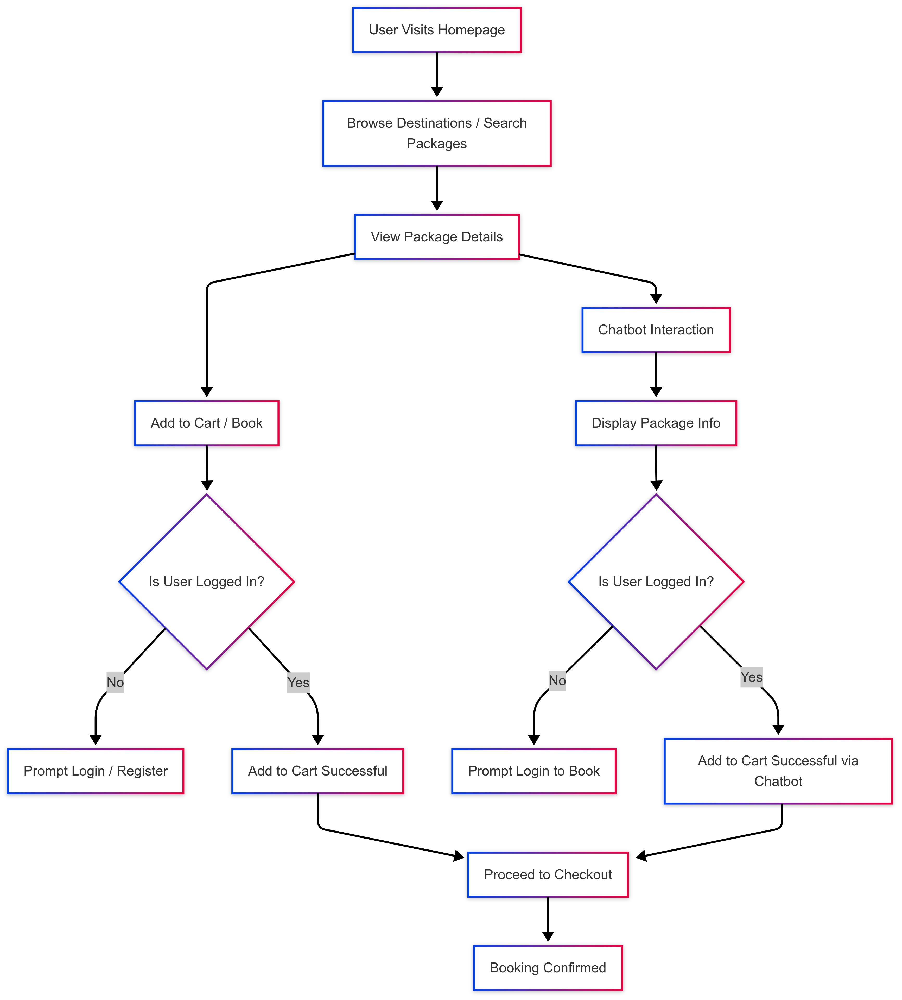

# Travelminds Travel Agency Web Application

## Project Overview

The Travelminds web application is a browser-based travel booking platform built on PHP 7.4+ and MySQL with a responsive Bootstrap frontend. It is designed to provide customers with an intuitive way to discover destinations and book travel packages while offering travel agents and administrators robust management tools. Key features include user authentication, destination exploration, package browsing, a shopping cart and checkout system (with payment gateway integration), and an AI-powered chatbot assistant. The platform is fully responsive and compatible with major modern browsers, ensuring a seamless experience on desktop and mobile devices alike.

## Core Functionalities

### User-Facing Features

*Figure 1: User Journey Flow - From Homepage to Booking Confirmation through Direct Booking and Chatbot Interaction Paths*

* **Destination Discovery System**

  * Responsive card-grid layout showcasing available destinations with images and summaries.
  * Advanced search and filtering by destination name, country, or description.
  * Dynamic price range indicators computed from associated travel packages.
  * Hero section with a prominent search bar for quick destination lookup.
  * Integrated real-time weather widget (Open-Meteo API) to display current conditions for each destination.

* **Package Management System**

  * Comprehensive package listing pages with filtering by destination and keyword search.
  * Sorting options (e.g. by price ascending) and pagination support for large result sets.
  * Detailed package pages featuring image galleries, day-by-day itinerary breakdowns, and descriptive content.
  * Inclusion and exclusion lists clarifying what is and isn’t covered in each package.
  * Real-time capacity indicators showing remaining available slots.
  * Related package recommendations based on matching attributes (similar destination, price range, etc.).

* **Booking System**

  * Interactive booking interface (modal dialog) with calendar date picker and party size selection.
  * Validation to ensure at least one traveler and future travel dates.
  * Real-time availability checks against the database to prevent overbooking.
  * Secure checkout workflow integrated with an external payment gateway (e.g. Stripe) for processing payments.
  * Webhook integration (via Make.com) to trigger notifications or workflows on successful bookings.

* **Shopping Cart Functionality**

  * Session-based cart that preserves selected packages across browsing sessions.
  * AJAX-driven dynamic updates (automatic refresh every few seconds) to reflect cart changes in real time.
  * Persistent storage of cart contents until purchase, with recovery if the user returns.
  * Price calculations verified against database values to prevent tampering.
  * Secure checkout flow with validation to ensure integrity of order data.

* **User Authentication System**

  * Secure registration and login system (via username or email) with PHP password hashing and input sanitization.
  * Role-based access controls distinguishing regular customers from travel agents and administrators.
  * User profile management (view/update personal information, password changes).
  * Booking history and active bookings displayed in the user’s profile.
  * Session management with timeout protection and CSRF token checks to maintain security.
  * Logout functionality that cleanly destroys the session and redirects the user.

* **AI-Powered Chatbot Assistant**

  * Floating chat widget available on all pages, providing on-demand travel assistance.
  * Real-time messaging interface with the AI assistant (powered by an NLP model such as Qwen 2.5B).
  * Natural language understanding for intent recognition (e.g. searching packages, pricing inquiries, booking requests) and entity extraction (dates, destinations, number of travelers).
  * Intelligent package recommendations and travel suggestions based on the conversation context.
  * Multi-turn dialogue support with conversation history tracking for a personalized experience.
  * Sentiment analysis to gauge user satisfaction and adjust responses.
  * Ability to initiate bookings or navigate to relevant packages directly from the chat interface.

### Administrative Features

* **Comprehensive Dashboard**

  * At-a-glance metrics on total bookings, revenue, and popular destinations.
  * Interactive charts for tracking bookings and sales over time.
  * User activity monitoring (e.g. recent registrations, current sessions) and system health indicators (server load, error logs).
  * Quick access to common management tasks (approve bookings, view reports).

* **Booking Management**

  * Interfaces for travel agents and administrators to view all bookings.
  * Ability to update booking statuses (pending, confirmed, canceled) and modify booking details (dates, party size).
  * Customer communication tools (e.g. email notifications when a booking is updated or canceled).
  * Payment tracking and verification to ensure bookings are paid before confirmation.

* **Reporting and Analytics**

  * Custom report generation on bookings and revenue (daily, monthly, by destination).
  * Analytics dashboards to identify trends in customer behavior and booking patterns.
  * Revenue forecasting and occupancy rate analysis.
  * Data export options (CSV or PDF) for deeper analysis or auditing.

## Technical Architecture

### Frontend Components

* **Responsive Design Framework**

  * Mobile-first layout built with the Bootstrap 5 grid system and custom CSS.
  * Flexible breakpoints ensure layouts adapt smoothly from mobile to desktop.
  * Consistent design language with a defined color palette (e.g., primary dark blue #2c3e50, secondary blue #3498db, accent red #e74c3c) and typography (Segoe UI stack).
  * Optimized asset loading (minification, lazy-loading of images, use of WebP format) for fast page rendering.

* **User Interface Elements**

  * Dynamic navigation bar with smooth scrolling effects; changes opacity or style on scroll.
  * Hero sections with full-viewport image carousels (auto-rotating every 5 seconds) including caption overlays and prominent call-to-action buttons.
  * Interactive forms across the site (search, booking, registration, newsletter) with client-side validation and instant feedback for users.
  * Toast notification system to display success/error messages for form submissions and actions.
  * Lazy loading of non-critical images and scroll-triggered animations (via Intersection Observer) for performance and engagement.

* **Template and Theming System**

  * Modular PHP templates for reusable components (header, footer, navigation) with conditional rendering based on user state (guest, user, or admin).
  * Centralized `functions.php` or similar utilities file providing common functionality (database connection, input sanitization, CSRF token generation, redirect helpers).
  * Thematic consistency enforced via shared CSS variables and classes: colors, fonts, and spacing defined in one place.
  * Responsive footer layout with columns for company info, quick links, and contact details, automatically adjusting on smaller screens.

### Backend Architecture

* **Server Environment**

  * PHP 7.4+ backend hosted on a LAMP stack (Linux, Apache/Nginx, MySQL).
  * Use of PDO (PHP Data Objects) with prepared statements for all database operations to ensure security and error handling.
  * Exception-based error handling; database and application errors are caught and logged.
  * Sensitive configuration (database credentials, API keys) stored in secured environment/config files, not in web-accessible paths.

* **API System**

  * RESTful PHP endpoints to support AJAX interactions (e.g., `/api_add_to_cart.php`, `/api_get_packages.php`, `/get_login_status.php`).
  * JSON is used for data interchange between frontend JavaScript and backend.
  * Endpoints include cart management (add/remove items), package retrieval (with JOIN on destinations), authentication status check, and chatbot message handling.
  * CORS headers configured to allow safe cross-origin requests (e.g., from a frontend development server) and CSRF tokens validated on state-changing requests.

* **Database Schema**

  * Relational MySQL schema with the following core tables:

    * **Users:** stores `id`, `username`, `email`, `password_hash`, `role` (ENUM user/admin), `created_at`.
    * **Destinations:** stores `id`, `name`, `description`, `image_url`, `base_price`, `country`.
    * **Packages:** stores `id`, `title`, `description`, `price`, `duration_days`, `status` (active/inactive), with a foreign key `destination_id` referencing Destinations.
    * **Bookings:** stores `id`, `user_id` (FK to Users), `package_id` (FK to Packages), `travel_date`, `number_of_people`, `status` (pending/confirmed/canceled).
  * Strong referential integrity enforced (foreign keys, ON DELETE behaviors).
  * Indexing on key columns (e.g. foreign keys, frequently searched fields) for performance.
  * Automated database initialization script: creates the database and tables if they do not exist, with error handling to log setup issues.

* **Security Implementation**

  * Passwords hashed using a secure algorithm (e.g., `password_hash` with bcrypt).
  * Input validation and sanitization across the application (server-side PHP checks and client-side JS checks).
  * Protection against SQL injection via PDO prepared statements on all database queries.
  * Cross-Site Scripting (XSS) prevention through output escaping (e.g., `htmlspecialchars`) for any user-generated content.
  * CSRF token usage on form submissions and sensitive API endpoints.
  * Encrypted session cookies with HTTP-only flags; session fixation protection and idle timeout (e.g. 30 minutes).
  * CORS policy restricting allowed origins (only trusted frontends) and enforcing credentials only when needed.
  * Rate limiting on critical operations (e.g., login attempts, chat requests) to mitigate abuse.

### AI Chatbot System

* **Frontend Integration**

  * Chat interface implemented (e.g. in React with TypeScript) and embedded as a floating component via `header.php`, making it accessible on every page.
  * Smooth UI/UX with animations (e.g. via Framer Motion) for opening/closing the chat and new message transitions.
  * Tailwind CSS (or Bootstrap utilities) used for consistent styling of the chat window, input field, and message bubbles.
  * Client-side state management (React Context or similar) to track conversation context and session data.

* **NLP and Conversational Intelligence**

  * Integration with a hosted language model (e.g. Qwen 2.5-1.5B Instruct) via REST API for interpreting user messages.
  * Intent recognition to detect common travel-related requests (destination info, package inquiries, booking operations).
  * Entity extraction for key details (dates, numbers, locations, party size, price constraints).
  * Sentiment analysis to monitor user mood and adjust the dialogue style if necessary.
  * Conversation state tracking for multi-turn dialogues, with context preservation between sessions.
  * Fallback responses for unrecognized inputs and error handling when the AI service is unavailable.

* **Backend Services**

  * PHP-based endpoints supporting the chatbot, such as `/api/chat/message` (handle incoming messages), `/api/chat/history` (retrieve past conversation with TTL), and `/api/chat/packages` (query package data based on context).
  * Session-aware processing: checks user login status and attaches user context to requests (allowing the bot to offer personalized recommendations).
  * Caching layer to store recent AI responses and conversation state (e.g. 1-hour TTL) to improve performance on repeated queries.
  * Rate limiting (e.g. 10 requests per minute per user) to manage load on the AI service.
  * Graceful degradation: if the AI service fails, the bot provides a default apologetic message and logs the error.
  * Integration points with booking logic: the bot can trigger actual booking workflows by interfacing with the booking system, subject to user confirmation and authentication.

## Non-Functional Characteristics

* **Performance Metrics**

  * Target response time under 2 seconds for most user interactions (page loads, form submissions, API calls).
  * First Contentful Paint (FCP) optimized to <1.5 seconds on initial page load.
  * Scalability to handle 100+ concurrent users without noticeable slowdown.
  * Optimized asset delivery: use of CDNs for libraries (Bootstrap, Font Awesome), minified CSS/JS, and image optimization (WebP format, lazy loading).

* **Security Standards**

  * All user passwords are securely hashed; sensitive data is encrypted in transit (HTTPS).
  * Strict input validation and output escaping at every entry point to prevent injection and XSS attacks.
  * CSRF tokens on forms and secure session management to protect against hijacking.
  * HTTP security headers (CSP, X-Frame-Options, etc.) configured for hardened protection.
  * CORS whitelist enforced for any cross-origin requests.
  * Audit logging of critical operations (e.g. failed login attempts, admin actions).

* **Accessibility**

  * Use of semantic HTML elements (header, nav, main, etc.) for screen-reader compatibility.
  * ARIA attributes on dynamic components (carousel controls, modals, form validation regions) for assistive technologies.
  * Support for keyboard navigation across all features (e.g. tabbing through menu items and forms).
  * Sufficient color contrast ratios and a reduced-motion mode to accommodate different user needs.
  * Descriptive alt text for all images (especially in destination listings and package galleries).

* **Usability and User Experience**

  * Intuitive navigation structure with clear labels (Destinations, Packages, About, Contact) and visible authentication links (Login/Register/Account).
  * Consistent UI patterns (buttons, cards, forms) across the site for a cohesive feel.
  * Immediate feedback on user actions: form inputs validate on-the-fly, and toast notifications summarize the outcome (e.g. “Booking confirmed”, “Error adding to cart”).
  * Error messages presented in a user-friendly manner, guiding users to corrective action without technical jargon.
  * Responsive layouts that maintain readability and functionality on small screens (collapsed menus, stacked cards, touch-friendly controls).

* **Maintainability**

  * Modular code organization: separation of concerns between frontend templates, backend logic, and utility functions.
  * Documented code and clear configuration (e.g. database setup script, environment variables) to aid future updates.
  * CSS and JS frameworks (Bootstrap, possibly Tailwind) allow for easy theming changes.
  * Use of version control and consistent coding standards to facilitate collaborative development and maintenance.

* **Browser Compatibility**

  * Full support for the latest versions of major browsers: Chrome (and Chromium-based Edge), Firefox, Safari.
  * Progressive enhancement ensures basic functionality even if advanced features are not supported (e.g. polyfill for `IntersectionObserver`, fallbacks for older browsers).
  * Graceful degradation: if JavaScript is disabled or a browser is outdated, the user can still navigate core content and receive appropriate messaging.

## User Interface and Experience

* **Design & Theming**

  * A cohesive visual design system with a defined color palette and typography ensures brand consistency.
  * UI components (buttons, cards, form fields) use Bootstrap styles customized with project-specific themes (primary/secondary colors).
  * UI consistency through shared CSS classes and variables so that updates to the theme reflect site-wide.

* **Responsive and Adaptive Layout**

  * The layout is mobile-first: grid-based pages and navigation collapse elegantly on smaller screens.
  * Interactive elements (hamburger menu, touch carousels) enhance mobile usability.
  * Content containers adjust fluidly, ensuring text remains readable and controls accessible on any device size.

* **Accessibility**

  * ARIA labels and roles on interactive controls (carousels, modals, chat) assist screen readers.
  * Focus indicators and skip-navigation links improve keyboard usability.
  * Designs account for reduced-motion preferences and provide alternate text for images.

* **Error Handling and Feedback**

  * Client-side form validation with clear inline error messages helps users correct mistakes immediately.
  * On submission errors (network issues or validation failures), the interface displays friendly notifications (e.g. toast alerts) explaining the problem.
  * Graceful fallbacks for network/API failures: the app can retry requests, show cached data, or guide the user to refresh as needed.

* **Browser Compatibility & Progressive Enhancement**

  * The application is tested on modern browsers and maintains core functionality on older versions.
  * Polyfills or fallbacks are used for newer web APIs to ensure graceful degradation (e.g. if `IntersectionObserver` is unavailable, images still load normally).
  * CSS and JS features leverage vendor prefixes or alternatives as needed to cover a broad audience.

